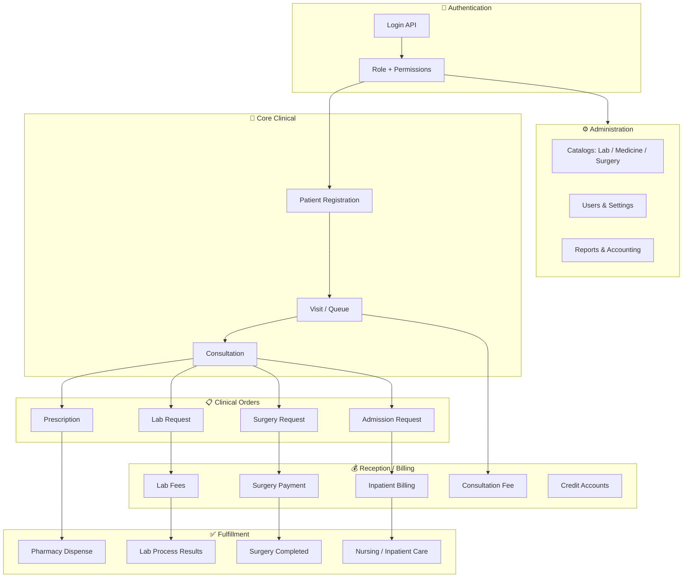
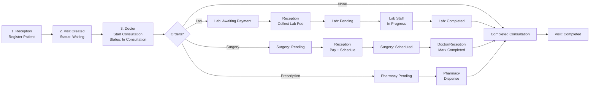
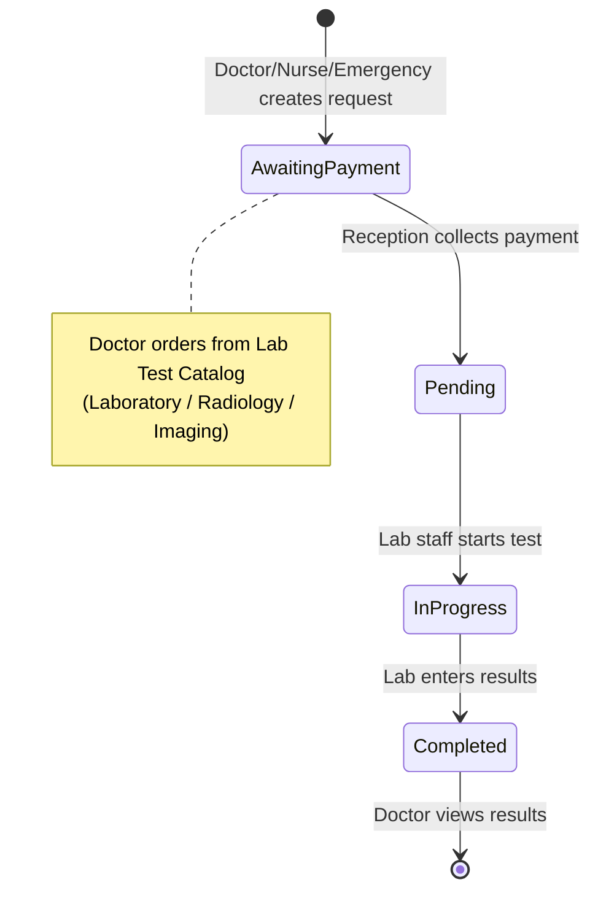
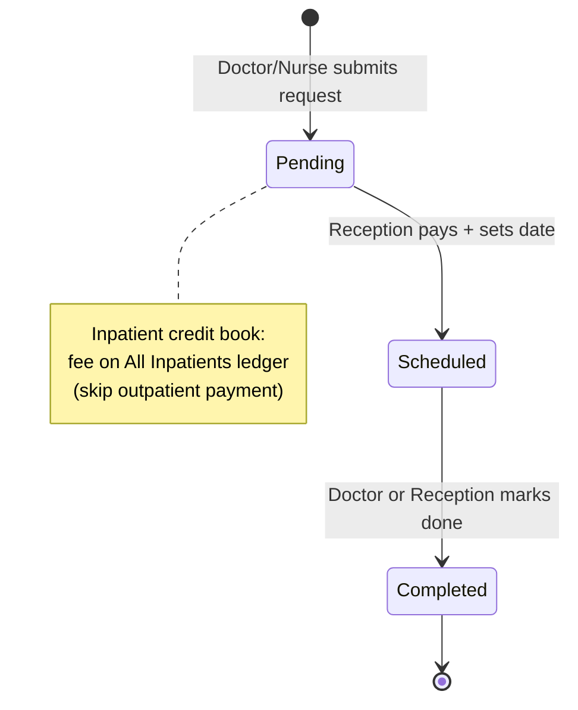
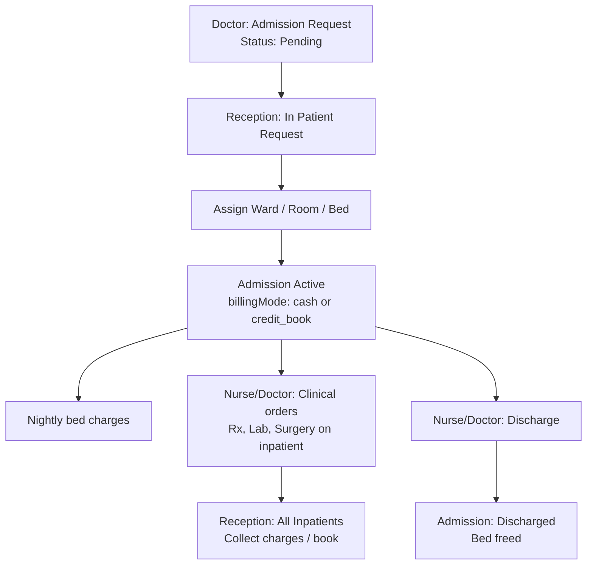
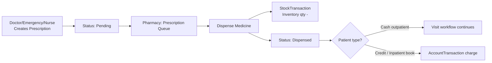
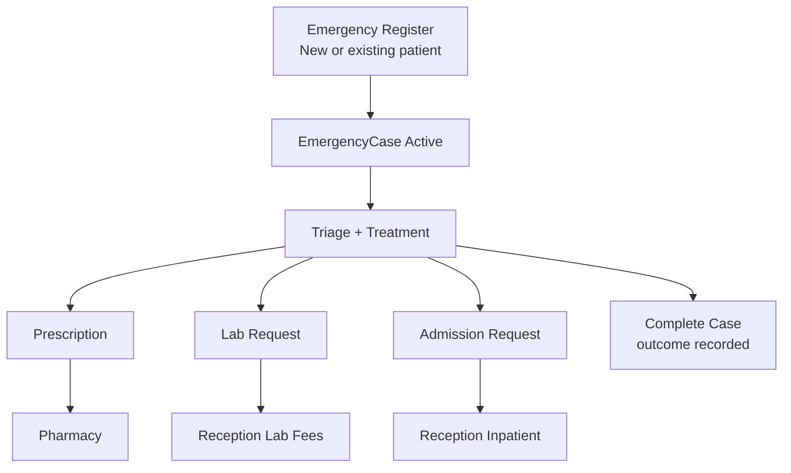
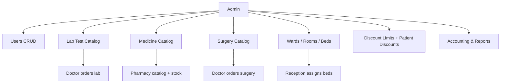
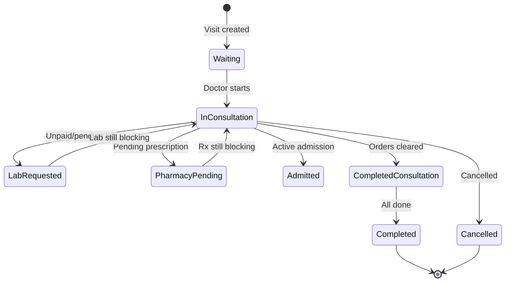

# FSH Hospital HMS — System Workflow Chart

> **Ujeeddo:** Qaab-dhismeedka nidaamka si backend loo xiro frontend-ka.  
> **Frontend:** React/TypeScript (`src/`) — hadda xogtu waa **in-memory** (`hmsStore.ts`).  
> **Backend:** API waa inuu beddelaa store-ka — isla workflow-ga hoos ku qoran.

---

## 1. Guud — Nidaamka Hospital-ka

---

## 2. Workflow-ga Bukaanka (Outpatient)

---

## 3. Workflow-ga Lab

**Xiriirka xogta:**
- `LabRequest` → `tests[]` (testName, result, normalRange)
- Qiimaha → `LabTestCatalog` (testId, category, price, sampleType)
- Lacag → `Payment` + `ReceptionReceipt` (type: lab)

---

## 4. Workflow-ga Surgery

**Xiriirka xogta:**
- `SurgeryRequest` → `surgeryCatalogId`, surgeryName, notes
- Catalog → `SurgeryCatalog` (category, anesthesia, risk, pre/post-op)
- Lacag → `Payment` + `ReceptionReceipt` (type: surgery)

---

## 5. Workflow-ga Inpatient (Admission)

---

## 6. Workflow-ga Pharmacy

---

## 7. Workflow-ga Emergency

**Ogsoonow:** Emergency **ma laha** `receive_payments` — lacagta waxaa qaada Reception.

---

## 8. Workflow-ga Admin & Catalogs

---

## 9. Visit Status — State Machine (Backend waa inuu ilaaliyaa)

**Xeerarka xannibaadda** (`visitConsultation.ts`):
- Visit ma dhammaan karo haddii lab **Awaiting Payment** / **Pending** / **In Progress**
- Visit ma dhammaan karo haddii prescription **Pending**
- Visit ma dhammaan karo haddii admission request **Pending**
- Visit ma dhammaan karo haddii surgery **Pending** (aan la bixin)

---

## 10. Role → Qaybaha Nidaamka (Overview)

| Role | Home Route | Mas'uuliyadda ugu weyn |
|------|------------|------------------------|
| **Admin** | `/hms/dashboard` | Users, catalogs, rooms, discounts, reports |
| **Reception** | `/hms/dashboard` | Register, billing, lab/surgery payment, inpatient |
| **Doctor** | `/hms/doctor/dashboard` | Consultation, orders, surgery complete |
| **Nurse** | `/hms/inpatient/dashboard` | Inpatient care, clinical orders, discharge |
| **Laboratory** | `/hms/laboratory/dashboard` | Process lab, enter results |
| **Pharmacy** | `/hms/pharmacy/dashboard` | Dispense, stock, supply approval |
| **Emergency** | `/hms/emergency/queue` | Triage, emergency treatment, register |

---

## 11. Backend API Endpoints (Suggested)

### Auth
| Method | Endpoint | Description |
|--------|----------|-------------|
| POST | `/api/auth/login` | Login → JWT + role + permissions |
| GET | `/api/auth/me` | Current user |
| POST | `/api/auth/logout` | Logout |

### Core flow (priority)
| Method | Endpoint | Description |
|--------|----------|-------------|
| POST | `/api/patients` | Register patient |
| POST | `/api/visits` | Create visit |
| PATCH | `/api/visits/:id/start-consultation` | Waiting → In Consultation |
| POST | `/api/visits/:id/clinical-notes` | Save note |
| POST | `/api/visits/:id/prescriptions` | Create prescription |
| POST | `/api/visits/:id/lab-requests` | Create lab order |
| POST | `/api/visits/:id/surgery-requests` | Create surgery order |
| POST | `/api/visits/:id/admission-requests` | Create admission order |
| POST | `/api/lab-requests/:id/pay` | Reception payment |
| PATCH | `/api/lab-requests/:id/process` | Lab status + results |
| POST | `/api/surgery-requests/:id/pay` | Reception pay + schedule |
| PATCH | `/api/surgery-requests/:id/complete` | Mark completed |
| POST | `/api/prescriptions/:id/dispense` | Pharmacy dispense |
| POST | `/api/admission-requests/:id/assign` | Assign bed |
| POST | `/api/admissions/:id/discharge` | Discharge patient |

### Catalogs (Admin)
| Method | Endpoint |
|--------|----------|
| CRUD | `/api/catalog/lab-tests` |
| CRUD | `/api/catalog/medicines` |
| CRUD | `/api/catalog/surgeries` |
| CRUD | `/api/wards`, `/api/rooms`, `/api/beds` |

---

## 12. Faylasha Tixraaca Frontend

| Fayl | Waxa ku jira |
|------|--------------|
| `src/shared/types/roles.ts` | Roles + permissions |
| `src/shared/types/index.ts` | Dhammaan entity types |
| `src/shared/services/hmsStore.ts` | Business logic + seed data |
| `src/shared/utils/visitConsultation.ts` | Visit workflow rules |
| `src/shared/config/hmsMenu.ts` | Menu per role |
| `src/routes/hmsRoutes.tsx` | Dhammaan routes |
| `docs/SYSTEM_ANALYSIS.md` | Falanqaynta user kasta + xogta |

---

*Last updated: June 2026 — FSH Hospital HMS*
